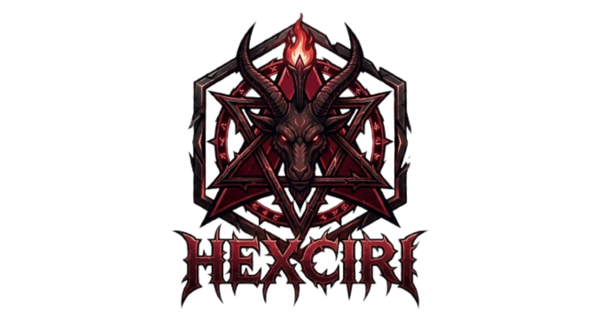

<div align="center">



Arch × Niri × Noctalia

[hexciri.dirty.pizza](https://hexciri.dirty.pizza)

</div>

## Install

1. Flash the Arch ISO, boot it (UEFI), connect network (`iwctl` for wifi).
2. Run it 

```bash
curl -Lo hexciri https://hexciri.dirty.pizza/install && sh hexciri
```

Pipe works identically: `curl -fsSL https://hexciri.dirty.pizza/install | bash`.

Kernel prompt (default auto):

| input | installs |
|---|---|
| `stock`, `lts` | `linux`, `linux-lts` |
| `omarchy`, `bore`, `muqss` | `linux-omarchy*` (bleeding) |

Full package names (`linux-omarchy-bore`) work too.

Encryption prompt (optional): `y` gives you LUKS2 on root — the passphrase is
your own user password, so there's nothing extra to type. Pre-flight: `sh hexciri --test-luks`
proves the cryptsetup chain on a throwaway file before any disk is touched.

3. Reboot → straight into Niri
Press `Mod+K` for the searchable keybinding list.

## Defaults (fresh install)

| slot | default | change it |
|---|---|---|
| terminal | `kitty` | `hexciri-defaults` → Terminal |
| shell | `fish` | `hexciri-defaults` → Shell |
| browser | `brave-origin` | `hexciri-defaults` → Browser |
| files | `strata` | `hexciri-defaults` → Files |
| editor | `zed` | `hexciri-defaults` → Editor |
| agent | `opencode` (`Mod+`` `) | `hexciri-defaults` → Agent |
| kernel | your pick, `linux` if auto (+`linux-lts` fallback on custom/legacy) | `hexciri-kernel` (bore/muqss on bleeding) |
| gpu | autodetect (mesa / nvidia-open / 580xx+LTS pin) | `hexciri-gpu` |
| encryption | opt-in LUKS2 on root (passphrase = your user password) | re-install |
| monitors | auto-detect (output blocks + scale from physical size) | `~/.config/niri/config.kdl` |
| bluetooth | on (bluez + bar widget) | — |
| theme | `sakurazuki` | `hexciri-theme-set` |
| channel | `stable` | `hexciri-channel-set` |
| boot | systemd-boot, plymouth splash, SDDM autologin | — |
| prompt/fetch | starship + fastfetch w/ emblem | `~/.config/starship.toml`, `~/.config/fastfetch/config.jsonc` |

## Channels

| channel | Arch mirror | pkgs | kernel menu |
|---|---|---|---|
| `stable` (default) | `stable-mirror.omarchy.org` | `pkgs.omarchy.org/stable` | `linux`, `linux-lts` |
| `bleeding` | `mirror.omarchy.org` | `pkgs.omarchy.org/edge` | + `linux-omarchy`, `-bore`, `-muqss` |

Stable is month-held pkgs; bleeding is normal Arch rolling release.


## GPU

Autodetected at install (mesa / `nvidia-open` / `580xx` with a hard LTS pin
on NVIDIA GTX 1xxx or older cards). To change later, re-run `hexciri-gpu`.


## Theme engine (colors.toml)

```bash
hexciri-theme-list
hexciri-theme-set <name>
hexciri-theme-install <git-url> | hexciri-theme-remove <name>
```

State: `~/.local/state/hexciri/current/{theme,theme.name,background}`.
Hook: `~/.config/hexciri/hooks/theme-set.d/` → `noctalia-sync.sh` writes
`~/.config/noctalia/palettes/hexciri.json`, patches `config.toml` + Niri
borders, and drives Qt theming (qt6ct Fusion palette).

## Highlights

- **Transparent terminals** — kitty runs at reduced background opacity with
  niri window-effect blur behind it. No focus ring / border: niri draws those
  as a solid rectangle behind the window (per its FAQ), which would cover the
  translucency.
- **Gaming** — `hexciri-gaming`: Steam, Heroic, Lutris, RetroArch, Minecraft,
  Battle.net (umu-launcher + GE-Proton), GeForce NOW, Xbox Cloud, GPU setup,
  Xbox controllers. `hexciri-packages` → Gaming for launchers.
- **Never-clobber config deploy** — install.sh sha-tracks configs: untouched
  ones update in place; if you've edited one, yours stays and the repo default
  lands as `<file>.hexciri` alongside (backups in `~/.config/hexciri-backup/`).

## Already on Arch?
Vanilla Arch with systemd-boot + NetworkManager? Skip the ISO flow:

```bash
git clone https://github.com/Deoxizn/hexciri.git ~/hexciri
cd ~/hexciri
./install.sh                     # stable channel
./install.sh --channel bleeding  # Rolling Release
./install.sh --kernel bore       # preselect GPU kernel (else auto-detect)
```