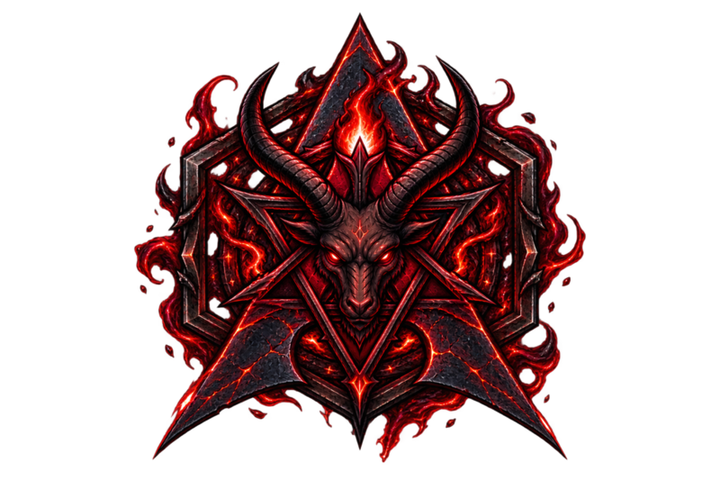

<div align="center">



Arch × Niri × Noctalia

[hexciri.dirty.pizza](https://hexciri.dirty.pizza)

</div>

## Install

1. Flash the Arch ISO, boot it (UEFI), connect network (`iwctl` for wifi).
2. Run it 

```bash
curl -LO https://hexciri.dirty.pizza/hexciri && sh hexciri
```

Pipe works identically: `curl -fsSL https://hexciri.dirty.pizza/hexciri | bash`.

Kernel prompt (default auto):

| input | installs |
|---|---|
| `stock`, `lts` | `linux`, `linux-lts` |
| `omarchy`, `bore`, `muqss` | `linux-omarchy*` (bleeding) |

Full package names (`linux-omarchy-bore`) work too.

The disk is left unencrypted — the login gate is the SDDM password prompt
(minimal themed greeter), there is no disk-encryption step to answer.

3. Reboot → straight into Niri
Press `Mod+K` for the searchable keybinding list.

## Defaults (fresh install)

| slot | default | change it |
|---|---|---|
| terminal | `kitty` | `hexciri-defaults` → Terminal |
| shell | `bash` (login) · `fish` (kitty) | `hexciri-defaults` → Shell |
| browser | `brave-origin` | `hexciri-defaults` → Browser |
| files | `strata` | `hexciri-defaults` → Files |
| editor | `zed` | `hexciri-defaults` → Editor |
| agent | `opencode` (`Mod+`` `) | `hexciri-defaults` → Agent |
| kernel | your pick, `linux` if auto (+`linux-lts` fallback on custom/legacy) | `hexciri-kernel` (bore/muqss on bleeding) |
| gpu | autodetect (mesa / nvidia-open / 580xx+LTS pin) | `hexciri-gpu` |
| monitors | auto-detect (output blocks + scale from physical size) | `~/.config/niri/config.kdl` |
| bluetooth | on (bluez + bar widget) | — |
| theme | `sakurazuki` | `hexciri-theme-set` |
| channel | `stable` | `hexciri-channel-set` |
| boot | systemd-boot, SDDM password/fingerprint greeter | — |
| prompt/fetch | starship + fastfetch w/ emblem | `~/.config/starship.toml`, `~/.config/fastfetch/config.jsonc` |

## Channels

| channel | Arch mirror | pkgs | kernel menu |
|---|---|---|---|
| `stable` (default) | `stable-mirror.omarchy.org` | `pkgs.omarchy.org/stable` | `linux`, `linux-lts` |
| `bleeding` | `mirror.omarchy.org` | `pkgs.omarchy.org/edge` | + `linux-omarchy`, `-bore`, `-muqss` |

Stable is month-held pkgs; bleeding is normal Arch rolling release.


## GPU

Autodetected at install (mesa / `nvidia-open` / `580xx` with a hard LTS pin
on NVIDIA GTX 1xxx or older cards). To change later, re-run `hexciri-gpu`.


## Theme engine (colors.toml)

```bash
hexciri-theme-list
hexciri-theme-set <name>
hexciri-theme-install <git-url> | hexciri-theme-remove <name>
```

State: `~/.local/state/hexciri/current/{theme,theme.name,background}`.
Hook: `~/.config/hexciri/hooks/theme-set.d/` → `noctalia-sync.sh` writes
`~/.config/noctalia/palettes/hexciri.json`, patches `config.toml` + Niri
borders, and drives Qt theming (qt6ct Fusion palette).

## Highlights

- **Transparent terminals** — kitty runs at reduced background opacity with
  niri window-effect blur behind it. No focus ring / border: niri draws those
  as a solid rectangle behind the window (per its FAQ), which would cover the
  translucency.
- **Gaming** — `hexciri-gaming`: Steam, Heroic, Lutris, RetroArch, Minecraft,
  Battle.net (umu-launcher + GE-Proton), GeForce NOW, Xbox Cloud, GPU setup,
  Xbox controllers. `hexciri-packages` → Gaming for launchers.
- **Never-clobber config deploy** — install.sh sha-tracks configs: untouched
  ones update in place; if you've edited one, yours stays and the repo default
  lands as `<file>.hexciri` alongside (backups in `~/.config/hexciri-backup/`).

## Already on Arch?
Vanilla Arch with systemd-boot + NetworkManager? Skip the ISO flow:

```bash
git clone https://github.com/Deoxizn/hexciri.git ~/hexciri
cd ~/hexciri
./install.sh                     # stable channel
./install.sh --channel bleeding  # Rolling Release
./install.sh --kernel bore       # preselect GPU kernel (else auto-detect)
```

## Sources

Bits of Hexciri are adapted from the following projects:

| Project | What Hexciri takes from it |
|---|---|
| [Omarchy](https://github.com/omacom/omarchy) | The bulk of `bin/hexciri-*` scripts + menu flow, repos/kernels idea, theme concepts |
| [Niri](https://github.com/YaLTeR/niri) | The Wayland compositor |
| [Noctalia](https://github.com/) | Desktop shell / widgets sitting on Niri |
| [Quickshell](https://github.com/outfoxxed/quickshell) | QML shell toolkit Noctalia is built on |
| [theme-hook-plugin-manager](https://github.com/OldJobobo/theme-hook-plugin-manager) | The entire `hooks/theme-set.d/` suite (29 hooks) + `theme-env.sh` runtime |
| [base16-Discord](https://github.com/imbypass/base16-discord) | Original "match system" Discord theme (predecessor to the ClearVision base) |
| [ClearVision-v7](https://github.com/ClearVision/ClearVision-v7) | "Hexciri" Discord theme — the whole-UI color reset tuned to the active palette |
| [system24](https://github.com/refact0r/system24) | "Hexciri System24" terminal-style Discord theme |
| [omarchy-nautilus-theme](https://github.com/ilJapo/omarchy-nautilus-theme) | GTK4/Libadwaita (Nautilus) CSS overrides + font re-stamp in `10-gtk.sh` |
| [omarchy-dune-theme](https://github.com/OldJobobo/omarchy-dune-theme) | Theme structure template for the bundled themes |
| [omarchy-sakurazuki-theme](https://github.com/ahmed-z0/omarchy-sakurazuki-theme) | Upstream sakurazuki theme Hexciri ships as its maiden default |
| [Adwaita-for-Steam](https://github.com/tkashkin/Adwaita-for-Steam) | Steam skin applied by the Steam theme hook |
| [omarchy-various-arch-theme](https://github.com/Deoxizn/omarchy-various-arch-theme) | Our own buddy theme (also seeded) |