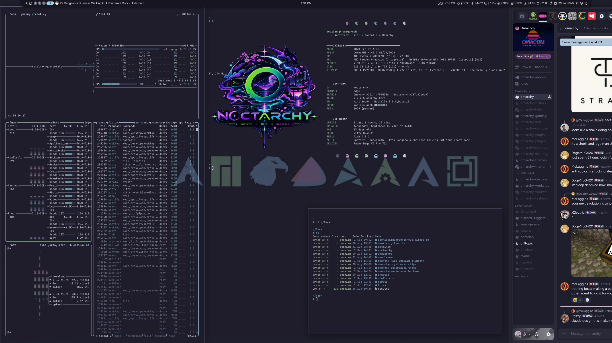

# Various Arch

Dark low-contrast Omarchy theme built around the `various-arch-v2` wallpaper — deep navy base sampled directly from the background (`#1F1E2C`), sky-blue accent from the dominant Arch logo, mint + lavender highlights from the remaining logos.

Compatible with the current Omarchy Quattro release (Quickshell-based shell).

## Preview



## Installation

```bash
omarchy-theme-install https://github.com/Deoxizn/omarchy-various-arch-theme.git
```

## What's Included

Built for Omarchy 4 (Quattro). `colors.toml` is the palette and does almost all the work: Omarchy renders Hyprland (`hyprland.lua`), Neovim, the Quickshell bar and lock screen, Alacritty, Foot, Ghostty, Kitty, btop, Chromium and VS Code from it through its own templates on install.

A theme installed from a git repo deliberately cannot ship `*.lua`, a terminal config or `vscode.json` — those name programs that get launched, so Omarchy generates them from the palette instead. That is why they are not in here.

That leaves:

| File | Consumer |
|------|----------|
| `colors.toml` | everything above |
| `shell.toml` | Quickshell bar, popups, notifications, launcher, menu, polkit, lock, image-picker (handcrafted, not generated) |
| `backgrounds/` | `omarchy theme bg next`, background switcher |
| `preview.png` / `preview-unlock.png` / `unlock.png` | theme switcher |
| `icons.theme` | `omarchy-theme-set-gnome` |

## Palette

Deep navy base, sky / mint / lavender pastels sampled from the wallpaper icons.

| Role   | Color     | Source |
|--------|-----------|--------|
| bg     | `#1F1E2C` | wallpaper background (measured) |
| fg     | `#D6DBE7` | cool off-white for navy |
| accent | `#99CEEF` | dominant sky-blue logo (~67k px) |
| mint   | `#ADE5B4` | green logos (~39k px) |
| lavender | `#DCB4EE` | pink triangle (~17k px) |
| cyan   | `#8AD1E1` | cyan logo |
| muted  | `#63677F` | desaturated navy gray |
| red    | `#B381A7` | dusty rose (terminal) |
| green  | `#87B28E` | dusty mint (terminal) |
| yellow | `#A9BFA4` | sage (terminal) |
| blue   | `#7A9FC0` | dusty sky (terminal) |
| magenta| `#9D8FC0` | dusty lavender (terminal) |
| cyan   | `#6EA7B4` | dusty teal (terminal) |

`hyprland_active_border` is a sky → lavender gradient (`rgba(99ceefee) rgba(dcb4eecc) 45deg`), `hyprland_inactive_border` is muted navy (`rgba(63677faa)`). Bar `active-border` is a triple sky → lavender → mint gradient covering all three logo families.